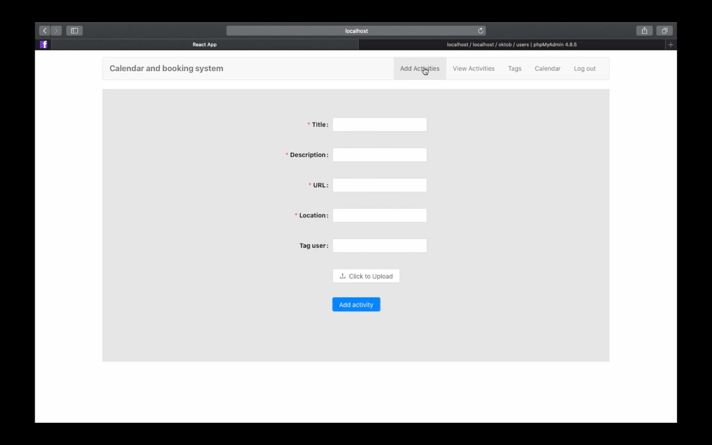
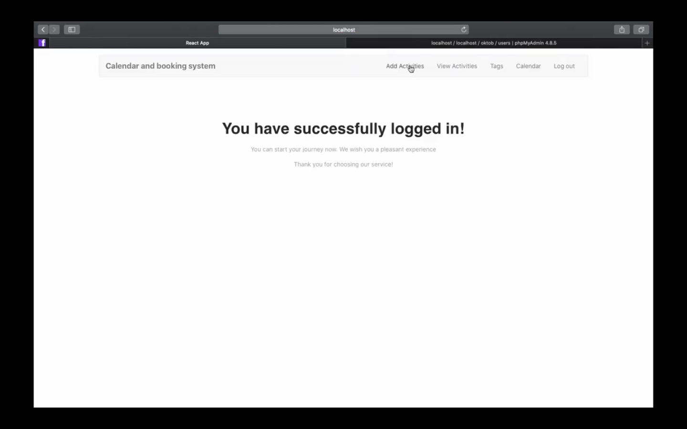
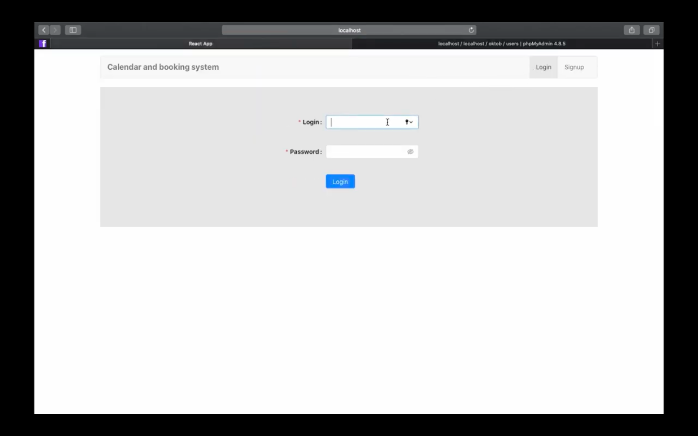
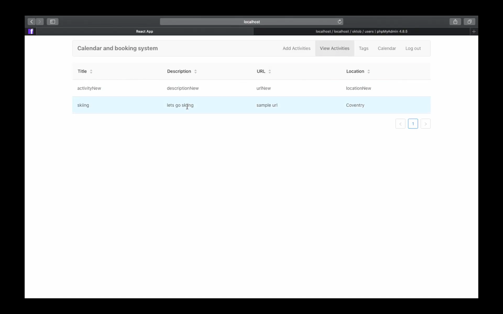

# Activity-booking-system

## Functionality
Activity booking system created in JavaScript split into the backend framework in NodeJS and frontend framework in React. 
The application benefits from signup and login pages, allows registered users to create activities, add other members and collaborate with them. 
Thus, the system aims to help with organising users' free time. The frontend framework fully connects to the backend environment through 
the utilisation of the RESTful APIs. The functionality of the project I was responsible for is shown on the featuring video.

## Presentation
<b></b>https://www.youtube.com/watch?v=0Jk159DQNLM

<table style="width:100%">
  <tr>
    <td></td>
    <td></td>
  </tr>
  <tr>
    <td></td>
    <td></td>
  </tr>
</table>
